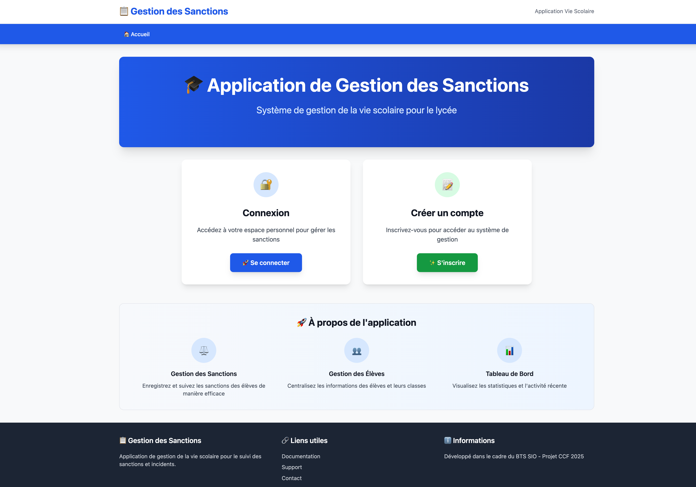

# 🏠 **US0 – Page d’accueil de l’application**

## 🎯 **Titre / Objectif**

> **En tant que** utilisateur (personnel de la vie scolaire ou visiteur)
> **Je veux** accéder à une page d’accueil claire et informative
> **Afin de** comprendre la finalité de l’application et choisir entre la connexion ou la création d’un compte

---

## 🔍 **Description**

Cette User Story correspond à la **page d’accueil principale** de l’application “Gestion des Sanctions”.
Elle constitue le **point d’entrée public** du site, accessible sans authentification.

L’objectif est de **présenter l’application** de manière simple et professionnelle, tout en **orientant l’utilisateur** vers les deux parcours principaux :

* la **connexion** (US1),
* ou la **création de compte** (US2).

La page d’accueil doit également présenter brièvement les **principales fonctionnalités** (Gestion des sanctions, des élèves, Tableau de bord) et contenir un **pied de page informatif** sur le projet.

---

## ✅ **Critères d’acceptation**

### **CA1 – Accès et structure**

* Page accessible publiquement via l’URL racine (`/` ou `index.php`).
* Titre clair : “Application de Gestion des Sanctions”.
* Sous-titre : “Système de gestion de la vie scolaire pour le lycée”.
* Deux boutons principaux :

  * **“Se connecter”** → redirection vers la page de connexion (US1)
  * **“S’inscrire”** → redirection vers la page de création de compte (US2)

---

### **CA2 – Présentation des fonctionnalités**

* Une section “À propos de l’application” présente les trois modules clés :

  * ⚖️ **Gestion des sanctions**
  * 👨‍🎓 **Gestion des élèves**
  * 📊 **Tableau de bord**
* Chaque bloc comporte une icône, un titre et une brève description.

---

### **CA3 – Pied de page (footer)**

* Contient trois colonnes :

  * **Gestion des sanctions** (description du projet)
  * **Liens utiles** (Documentation, Support, Contact)
  * **Informations** (mention “Développé dans le cadre du BTS SIO – Projet CCF 2025”)
* Présentation claire et cohérente avec la charte graphique.

---

### **CA4 – Design et ergonomie**

* Interface **moderne, responsive et cohérente** avec les pages internes (Dashboard, connexion, etc.).
* Utilisation d’un **ton institutionnel**, lisible sur ordinateur et tablette.
* Les boutons “Se connecter” et “S’inscrire” sont clairement différenciés (couleurs bleu et vert).
* Le temps de chargement ne doit pas dépasser **3 secondes**.

---

## 📊 **Données et règles métier**

| Élément                   | Règle métier                                              |
| ------------------------- | --------------------------------------------------------- |
| **Page publique**         | Accessible sans connexion                                 |
| **Boutons d’action**      | Redirigent vers les pages internes correspondantes        |
| **Texte de présentation** | Présente la finalité de l’application et son public cible |
| **Footer**                | Doit mentionner le cadre pédagogique (BTS SIO, CCF 2025)  |

---

## ⏱️ **Estimation**

* **Complexité** : Faible
* **Story Points** : 2
* **Priorité** : ★★★ (Sprint 1 – indispensable pour la navigation initiale)

---

## 📌 **Dépendances**

* **US1 – Connexion utilisateur** (redirection du bouton “Se connecter”)
* **US2 – Création de compte utilisateur** (redirection du bouton “S’inscrire”)
* **US21 – Interface claire et intuitive** (charte graphique et cohérence visuelle)

---

## 👥 **Parties prenantes**

| Rôle                        | Responsabilité                                                       |
| --------------------------- | -------------------------------------------------------------------- |
| **Product Owner**           | Définit le contenu et la structure de la page d’accueil              |
| **Équipe de développement** | Implémente la page et assure la navigation vers les modules internes |
| **Utilisateur final**       | Teste la lisibilité, la cohérence et la facilité d’accès             |

---

## ✅ **Definition of Done**

* Page d’accueil accessible sans connexion.
* Les boutons redirigent correctement vers les pages de connexion et d’inscription.
* Présentation des fonctionnalités et du projet claire et responsive.
* Footer complet et cohérent avec la maquette.
* Interface validée par le Product Owner.

---

## 💻 **Maquette indicative**

> La maquette ci-dessus illustre la structure attendue :
>
> * en-tête avec le titre du projet,
> * deux cartes principales “Connexion” et “Créer un compte”,
> * section “À propos de l’application”,
> * pied de page avec les mentions du projet.
>
> Cette maquette est indicative : le développeur pourra adapter le design selon la charte graphique et les contraintes techniques.

