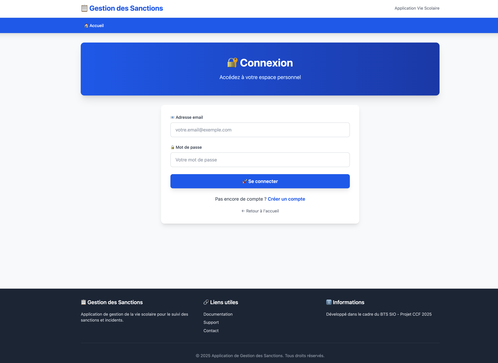

# 🔐 **US1 – Connexion utilisateur**

## 🎯 **Titre / Objectif**

> **En tant que** personnel de la vie scolaire (CPE, surveillant, secrétaire)
> **Je veux** me connecter à l’application avec mon e-mail et mon mot de passe
> **Afin de** accéder à mon espace personnel sécurisé et gérer les sanctions des élèves

---

## 🔍 **Description**

Cette User Story permet aux membres du personnel de la vie scolaire de **s’authentifier de manière sécurisée** pour accéder à leur espace personnel.
L’authentification doit être **simple**, **rapide** et **fiable**, tout en garantissant la **confidentialité des identifiants**.

L’accès à toutes les fonctionnalités internes (gestion des classes, élèves, sanctions, etc.) est **restreint aux utilisateurs authentifiés**.
La connexion constitue donc une **porte d’entrée essentielle** à l’application.

Dans le cadre de cette US, l’équipe devra également **finaliser le parcours utilisateur** en intégrant la redirection depuis la création de compte (US2) vers la page de connexion.

---

## ✅ **Critères d’acceptation**

### **CA1 – Formulaire de connexion**

* Accessible depuis la page d’accueil via un bouton **“Se connecter”**.
* Le formulaire comporte deux champs : **e-mail** et **mot de passe**.
* Les champs sont **obligatoires**.
* Les erreurs de saisie (champ vide, format invalide) affichent un message clair.
* Interface claire, lisible et responsive.

---

### **CA2 – Validation et authentification**

* Vérification que l’e-mail existe et que le mot de passe correspond.
* En cas d’erreur, affichage d’un message générique (“Identifiants incorrects”).
* Redirection automatique vers le tableau de bord en cas de succès.

---

### **CA3 – Sécurité**

* Le mot de passe est comparé uniquement sous forme **hachée**.
* L’accès aux pages internes est **bloqué** si l’utilisateur n’est pas connecté.
* Les messages d’erreur ne révèlent **aucune donnée sensible**.
* Le système empêche toute tentative d’accès direct sans authentification.

---

### **CA4 – Expérience utilisateur**

* Un message de bienvenue est affiché après connexion réussie.
* L’interface est cohérente avec la charte graphique de l’application.
* Le temps de réponse reste inférieur à **3 secondes**.

---

### **CA5 – Parcours utilisateur complet (avec US2)**

* Après la création d’un compte (US2), l’utilisateur est **redirigé automatiquement vers la page de connexion**.
* Le parcours “Créer un compte → Se connecter” est fluide et sans rupture.
* Ce comportement complète l’expérience utilisateur initiale prévue dans l’US2.

---

## 📊 **Règles métier**

| Élément          | Règle fonctionnelle                                                                  |
| ---------------- | ------------------------------------------------------------------------------------ |
| **E-mail**       | Doit être unique et conforme à un format valide.                                     |
| **Mot de passe** | Doit correspondre au hash enregistré en base.                                        |
| **Accès**        | Seuls les utilisateurs connectés peuvent consulter ou modifier les données internes. |
| **Session**      | Créée à la connexion, détruite à la déconnexion.                                     |

---

## ⏱️ **Estimation**

* **Complexité** : Moyenne
* **Story Points** : 3
* **Priorité** : ★★★ (Critique – Sprint 2)

---

## 📌 **Dépendances**

* **Dépend de :**

  * **US2 – Création de compte utilisateur** (des comptes doivent exister pour permettre la connexion).

* **Inclut :**

  * L’intégration de la **redirection post-inscription** prévue dans l’US2.

---

## 👥 **Parties prenantes**

| Rôle                                 | Responsabilité                                                                   |
| ------------------------------------ | -------------------------------------------------------------------------------- |
| **Product Owner**                    | Définit le besoin, valide la simplicité et la sécurité du parcours de connexion. |
| **Équipe de développement**          | Implémente le mécanisme de connexion et la redirection depuis l’inscription.     |
| **Utilisateur final (vie scolaire)** | Teste la clarté du processus et la fluidité du parcours.                         |

---

## ✅ **Définition de “Terminé” (Definition of Done)**

* Le formulaire de connexion fonctionne sur desktop et mobile.
* L’authentification est sécurisée et testée (identifiants valides/invalides).
* La redirection post-inscription (US2 → US1) est fonctionnelle.
* Les sessions sont correctement créées et détruites.
* Les tests de non-régression et de sécurité sont validés.
* L’US est revue et approuvée lors de la revue de sprint.

--- 

## 💻 Maquette indicative

> La maquette ci-dessus illustre la structure souhaitée :
> Cette disposition est indicative : l’équipe pourra l’adapter selon les choix d’implémentation.