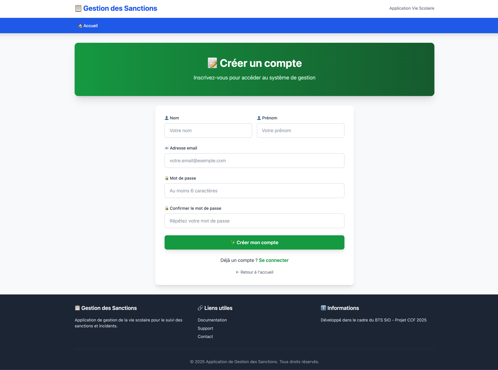

# 👤 **US2 – Création d’un compte utilisateur**

## 🎯 **Titre / Objectif**

> **En tant que** personnel de la vie scolaire (CPE, surveillant, secrétaire)
> **Je veux** créer mon propre compte utilisateur
> **Afin de** pouvoir accéder à l’application sans intervention d’un administrateur

---

## 🔍 **Description**

Cette User Story permet à un membre du personnel de la vie scolaire de **créer lui-même un compte personnel** afin d’accéder à l’application.
L’objectif est de **simplifier la mise en service** et **d’éviter toute dépendance à un administrateur technique**.

Le formulaire d’inscription doit être **clair, rapide à remplir et sécurisé**.
Une fois le compte créé, l’utilisateur doit recevoir un **message de confirmation** indiquant que l’inscription est réussie.

Cette fonctionnalité constitue le **point d’entrée** du parcours utilisateur : c’est elle qui permet d’alimenter la base des utilisateurs autorisés à accéder au système.

---

## ✅ **Critères d’acceptation**

### **CA1 – Formulaire d’inscription**

* Accessible depuis la page d’accueil via un bouton **“Créer un compte”** ou **“S’inscrire”**
* Le formulaire contient les champs : **nom**, **prénom**, **adresse e-mail**, **mot de passe**
* Tous les champs sont **obligatoires**
* Un message de confirmation apparaît après la création du compte

---

### **CA2 – Validation et sécurité**

* L’adresse e-mail doit être **unique** (aucun doublon possible)
* Le mot de passe doit respecter un **minimum de sécurité** :
  au moins **8 caractères**, incluant **une majuscule** et **un chiffre**
* Les données sont **vérifiées** avant enregistrement
* Le mot de passe est **haché** avant d’être stocké

---

### **CA3 – Après la création du compte**

* Le compte est enregistré et **actif immédiatement** après validation du formulaire
* Un **message de confirmation** informe l’utilisateur que son inscription est réussie
* L’utilisateur sera **redirigé vers la page de connexion (US1)** dès que celle-ci sera disponible dans un prochain sprint

---

### **CA4 – Expérience utilisateur**

* Interface simple, claire et cohérente avec la charte graphique
* Temps de réponse acceptable (< 3 secondes)
* Messages d’erreur clairs et compréhensibles en cas de problème de saisie

---

## 📊 **Données et règles métier**

| Donnée           | Règle métier                                                             |
| ---------------- | ------------------------------------------------------------------------ |
| **Nom**          | Obligatoire, texte entre 2 et 50 caractères                              |
| **Prénom**       | Obligatoire, texte entre 2 et 50 caractères                              |
| **Email**        | Obligatoire, unique, format valide                                       |
| **Mot de passe** | Obligatoire, au moins 8 caractères, incluant une majuscule et un chiffre |
| **Compte actif** | Le compte est immédiatement actif après inscription                      |

---

## ⏱️ **Estimation**

* **Complexité** : Moyenne
* **Story Points** : 3
* **Priorité** : ★★★ (Critique – Sprint 1)

---

## 📌 **Dépendances**

* **Aucune dépendance** : cette User Story est **autonome** et peut être développée en premier.
  Elle servira ensuite de **pré-requis pour l’US1 – Connexion utilisateur**.

---

## 👥 **Parties prenantes**

| Rôle                                 | Responsabilité                                                       |
| ------------------------------------ | -------------------------------------------------------------------- |
| **Product Owner**                    | Définit les champs et valide la simplicité du parcours d’inscription |
| **Équipe de développement**          | Implémente le formulaire et la vérification des données              |
| **Utilisateur final (vie scolaire)** | Teste la facilité de création du compte                              |

---

## ✅ **Définition de “Terminé” (Definition of Done)**

* Le formulaire d’inscription fonctionne entièrement.
* Les validations et messages d’erreur sont conformes.
* Le mot de passe est stocké de manière sécurisée (haché).
* Le compte est immédiatement actif après création.
* L’interface est claire et testée sur desktop et mobile.
* L’US est revue et validée lors de la revue de sprint.

--- 

## 💻 Maquette indicative

> La maquette ci-dessus illustre la structure souhaitée :
> Cette disposition est indicative : l’équipe pourra l’adapter selon les choix d’implémentation.