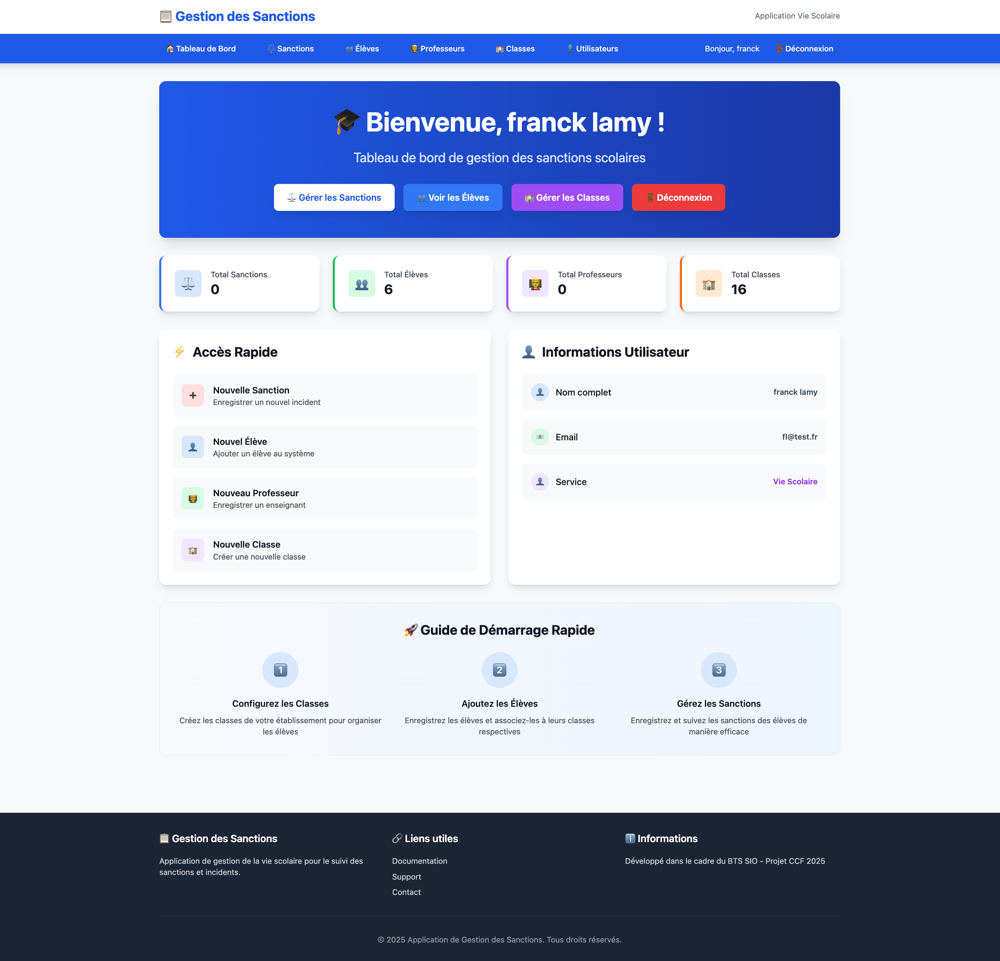

# 🧭 **US25 – Dashboard utilisateur**

## 🎯 **Titre / Objectif**

> **En tant que** personnel de la vie scolaire connecté
> **Je veux** accéder à une page d’accueil (Dashboard) après ma connexion
> **Afin de** visualiser les informations principales et naviguer facilement vers les différentes fonctionnalités de l’application

---

## 🔍 **Description**

Le **Dashboard utilisateur** est la **page d’accueil de l’espace connecté**.
Il apparaît immédiatement après une connexion réussie (US1) et sert de **point central de navigation**.

Dans sa première version (Sprint 1), le Dashboard doit :

* accueillir l’utilisateur par un **message de bienvenue personnalisé** (ex. “Bonjour Julie !”),
* afficher les **liens vers les principales sections** de l’application (Classes, Élèves, Professeurs, Sanctions),
* inclure un **bouton de déconnexion (US4)** visible en permanence.

Le Dashboard évoluera au fil des sprints pour intégrer :

* des **résumés** (nombre de classes, d’élèves, de sanctions),
* des **statistiques visuelles (US23)**,
* et éventuellement des **notifications**.

---

## ✅ **Critères d’acceptation**

### **CA1 – Accès et affichage**

* Accessible uniquement après une **connexion réussie** (US1).
* Redirection automatique vers le Dashboard dès que l’authentification est validée.
* Message de bienvenue visible (“Bonjour [Prénom]”).

---

### **CA2 – Navigation**

* Le Dashboard présente des liens ou boutons vers les modules :

  * 🏫 **Classes**
  * 👨‍🎓 **Élèves**
  * 👩‍🏫 **Professeurs**
  * ⚖️ **Sanctions**
* Chaque lien redirige vers la page correspondante.
* Le **bouton “Déconnexion” (US4)** est accessible depuis le Dashboard.

---

### **CA3 – Ergonomie et cohérence**

* Interface **claire, lisible et cohérente** avec le reste de l’application (US21).
* Structure en **cartes ou boutons clairs** pour chaque module.
* Temps de chargement inférieur à **3 secondes**.

---

### **CA4 – Évolutivité**

* L’architecture du Dashboard permet d’ajouter de nouvelles informations sans refactorisation majeure.
* Les futures fonctionnalités (statistiques, notifications) pourront être intégrées facilement.

---

## 📊 **Données et règles métier**

| Élément                  | Règle métier                                         |
| ------------------------ | ---------------------------------------------------- |
| **Utilisateur**          | Doit être authentifié pour accéder au Dashboard      |
| **Navigation**           | Liens internes vers les pages de gestion             |
| **Message de bienvenue** | Généré à partir du prénom de l’utilisateur connecté  |
| **Évolutivité**          | Structure modulaire pour permettre des ajouts futurs |

---

## ⏱️ **Estimation**

* **Complexité** : Faible
* **Story Points** : 2
* **Priorité** : ★★★ (Sprint 1 – Critique pour parcours utilisateur)

---

## 📌 **Dépendances**

* **US1 – Connexion utilisateur** : redirection vers le Dashboard après connexion réussie.
* **US4 – Déconnexion utilisateur** : bouton présent sur la page.
* **US21 – Interface claire et intuitive** : cohérence visuelle.

---

## 👥 **Parties prenantes**

| Rôle                                 | Responsabilité                                            |
| ------------------------------------ | --------------------------------------------------------- |
| **Product Owner**                    | Définit la structure et le contenu du Dashboard.          |
| **Équipe de développement**          | Implémente l’affichage, la redirection et la navigation.  |
| **Utilisateur final (vie scolaire)** | Teste la lisibilité et la cohérence de la page d’accueil. |

---

## ✅ **Definition of Done**

* Le Dashboard s’affiche automatiquement après connexion.
* Message de bienvenue affiché avec le prénom de l’utilisateur.
* Liens vers les sections principales fonctionnels.
* Bouton “Déconnexion” opérationnel.
* Interface claire, validée par le Product Owner.

---
## 💻 Maquette indicative

> La maquette ci-dessus illustre la structure souhaitée :
> Cette disposition est indicative : l’équipe pourra l’adapter selon les choix d’implémentation.
## 💡 **Remarques**

* Le Dashboard est une **base évolutive** : il sera enrichi progressivement.
* Il constitue la **page pivot** de l’expérience utilisateur.

