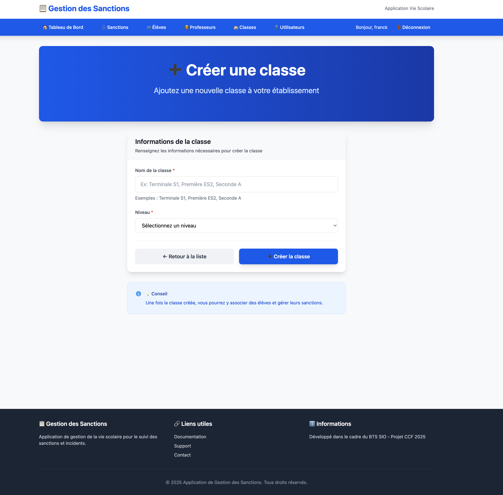

# 🏫 **US5-1 – Création de classe**

## 🎯 **Titre / Objectif**

> **En tant que** personnel de la vie scolaire connecté  
> **Je veux** pouvoir créer une classe dans l’application  
> **Afin de** organiser les élèves par groupe et faciliter leur gestion

---

## 🔍 **Description**

Cette User Story permet à un membre du personnel de la vie scolaire d’**ajouter une nouvelle classe** dans l’application.  
Chaque classe représente un **groupe d’élèves** appartenant à un même niveau (ex. : *Seconde B*, *1ère STMG*, *Terminale S*).  

L’objectif est de **structurer les données de l’établissement** afin de préparer la gestion des élèves et le suivi des sanctions par classe.  

L’utilisateur saisit le **nom** et le **niveau** de la classe puis valide la création.  
Après confirmation, il est **redirigé automatiquement vers la liste des classes** (US5-2),  
où la classe nouvellement créée est immédiatement visible.  

Cette fonctionnalité et l’US5-2 constituent le **module complet de gestion des classes** du Sprint 1.

---

## ✅ **Critères d’acceptation**

### **CA1 – Formulaire de création**
* Accessible uniquement pour un utilisateur **connecté**.  
* Le formulaire contient les champs :  
  - **Nom de la classe** (ex. : “1ère B”)  
  - **Niveau** (ex. : “Première”, “Terminale”, etc.)  
* Tous les champs sont **obligatoires**.  
* Un bouton **“Créer la classe”** enregistre la classe.  

---

### **CA2 – Confirmation et redirection après création**
* Après validation, un **message de confirmation** indique que la classe a été créée avec succès.  
* L’utilisateur est automatiquement **redirigé vers la liste des classes** (US5-2).  
* La nouvelle classe apparaît **immédiatement dans la liste**, clairement identifiable.  

---

### **CA3 – Expérience utilisateur**
* Interface **simple, claire et cohérente** avec les autres écrans.  
* Messages d’erreur explicites (ex. : “Le nom de la classe est obligatoire”).  
* Validation et redirection rapides (réponse < 3 secondes).  

---

## 📊 **Données et règles métier**

| Donnée             | Règle métier                                                   |
| ------------------ | -------------------------------------------------------------- |
| **Nom de classe**  | Obligatoire, texte court (ex. : “1ère B”, “2nde A”).          |
| **Niveau**         | Obligatoire, valeur issue d’une liste (Seconde, Première, etc.). |
| **Identifiant interne** | Généré automatiquement par le système.                    |

---

## ⏱️ **Estimation**

* **Complexité** : Faible  
* **Story Points** : 2  
* **Priorité** : ★★★ (Sprint 1)

---

## 📌 **Dépendances**

* **US1 – Connexion utilisateur** : l’utilisateur doit être connecté.  
* **Travaille conjointement avec :** **US5-2 – Consultation des classes** (redirection vers la liste après création).  

---

## 👥 **Parties prenantes**

| Rôle | Responsabilité |
|------|----------------|
| **Product Owner** | Définit les champs et valide le parcours “création → liste”. |
| **Équipe de développement** | Implémente le formulaire, la validation, l’enregistrement et la redirection. |
| **Utilisateur final (vie scolaire)** | Teste la facilité et la fluidité de la création de classe. |

---

## ✅ **Definition of Done**

* Formulaire fonctionnel et validation des champs obligatoires.  
* Message de confirmation après création réussie.  
* Redirection automatique vers la liste (US5-2).  
* La nouvelle classe apparaît bien dans la liste.  
* Interface claire et validée par le Product Owner.  

--- 

## 💻 Maquette indicative

> La maquette ci-dessus illustre la structure souhaitée :
> Cette disposition est indicative : l’équipe pourra l’adapter selon les choix d’implémentation.