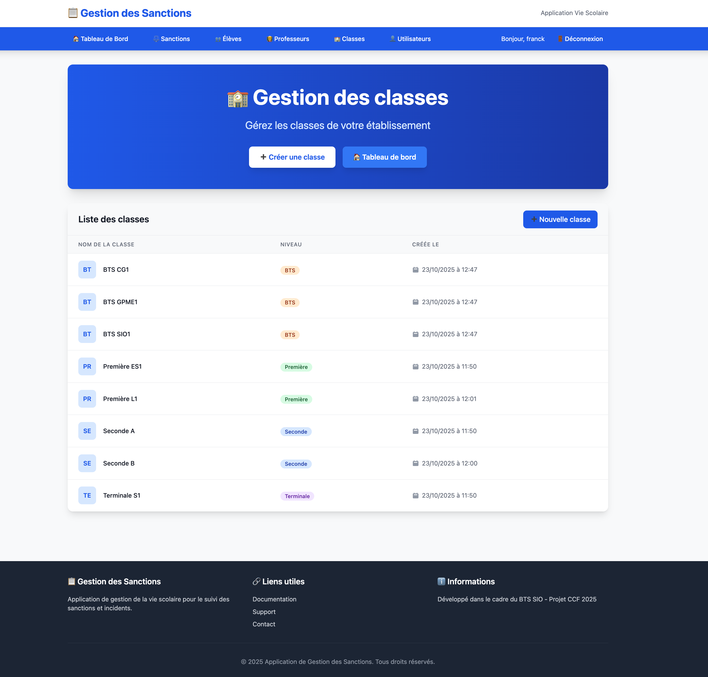

# 📋 **US5-2 – Consultation des classes**

## 🎯 **Titre / Objectif**

> **En tant que** personnel de la vie scolaire connecté  
> **Je veux** pouvoir consulter la liste des classes enregistrées  
> **Afin de** visualiser rapidement les classes existantes et vérifier leur création

---

## 🔍 **Description**

Cette User Story permet au personnel de la vie scolaire d’**afficher la liste complète des classes** présentes dans le système.  
L’objectif est de **rendre visibles** les classes créées et de faciliter la navigation dans le module “Gestion des classes”.  

L’utilisateur accède à la liste depuis le menu principal.  
Les classes y sont **présentées de manière claire et triée**, avec leurs informations essentielles (nom, niveau, date de création).  

Elle complète directement l’US5-1 en **offrant la continuité naturelle du parcours utilisateur** :  
après avoir créé une classe, l’utilisateur est redirigé vers cette page pour en visualiser le résultat.

---

## ✅ **Critères d’acceptation**

### **CA1 – Accès et affichage**
* Accessible uniquement pour un utilisateur **connecté**.  
* Page “Liste des classes” disponible dans le menu principal.  
* Chaque ligne affiche : **nom**, **niveau**, **date de création**.  
* Si aucune classe n’existe : message “Aucune classe enregistrée”.  

---

### **CA2 – Présentation et ergonomie**
* Tableau clair et lisible, trié par **niveau** puis par **nom**.  
* Design cohérent avec le reste de l’application.  
* Interface responsive et fluide.  

---

### **CA3 – Cohérence des données**
* Toutes les classes créées via l’US5-1 apparaissent dans la liste.  
* Les données sont à jour et sans doublon.  

---

### **CA4 – Redirection post-création**
* Après la création d’une classe (US5-1), l’utilisateur est **redirigé automatiquement** vers cette page.  
* Un message discret (“Classe créée avec succès”) s’affiche en haut de la liste.  
* La classe nouvellement créée est **immédiatement visible**.  

---

## 📊 **Données et règles métier**

| Donnée | Règle métier |
|--------|---------------|
| **Nom de classe** | Affiché tel qu’enregistré. |
| **Niveau** | Affiché à côté du nom. |
| **Date de création** | Renseignée automatiquement. |
| **Tri** | Par niveau puis par nom (ordre alphabétique). |

---

## ⏱️ **Estimation**

* **Complexité** : Moyenne  
* **Story Points** : 3  
* **Priorité** : ★★★ (Sprint 1)

---

## 📌 **Dépendances**

* **US1 – Connexion utilisateur** : accès restreint.  
* **Travaille conjointement avec :** **US5-1 – Création de classe** (flux “création → liste”).  

---

## 👥 **Parties prenantes**

| Rôle | Responsabilité |
|------|----------------|
| **Product Owner** | Définit les informations affichées et la logique de redirection. |
| **Équipe de développement** | Implémente la page, le tri et l’affichage dynamique. |
| **Utilisateur final (vie scolaire)** | Teste la clarté et la cohérence de la liste. |

---

## ✅ **Definition of Done**

* Page “Liste des classes” fonctionnelle et accessible.  
* Données affichées de manière lisible et triée.  
* Redirection automatique après création d’une classe (US5-1).  
* Message “Classe créée avec succès” visible.  
* Interface validée par le Product Owner.  

--- 

## 💻 Maquette indicative

> La maquette ci-dessus illustre la structure souhaitée :
> Cette disposition est indicative : l’équipe pourra l’adapter selon les choix d’implémentation.